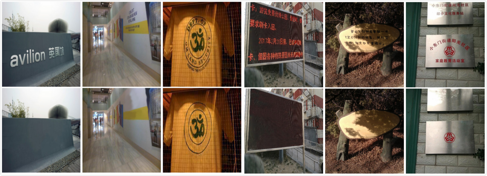
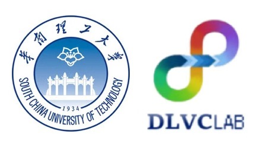

# SCUT-EnsText

Under complete construction and will be available in the near future...

The SCUT-EnsText Dataset for the research of scene text removal will be released by Deep Leaning and Visual Computing Lab of South China University of Technology. The dataset can be downloaded through the following link:

train set - [Baidu Cloud](https://pan.baidu.com/s/1BMVEbis2uL06hSlx-Vd0KA) (Password : 5xwi)

test set - [Baidu Cloud](https://pan.baidu.com/s/1dRqQqLvOq21PV8G8PsA3dw) (Password : 23cx) (Now only the Baidu Cloud link is available. We will continue to update the dataset link in the future.) 

Note: The SCUT-EnsText dataset can only be used for non-commercial research purpose. For scholars or organization who wants to use the SCUT-EnsText database, please first fill in this [Application Form](https://github.com/HCIILAB/SCUT-EnsText/blob/master/Application_Form/Application_Form_for_Using_SCUT-EnsText_2020.doc) and send it via email to us (eelwjin@scut.edu.cn, or lianwen.jin@gmail.com). When submiting the application form to us, please list or attached 1-2 of your publications in recent 6 years to indicate that you (or your team) do research in the related research fields of OCR, image inpainting, text editting, and so on.  We will give you the decompression password after your letter has been received and approved.

## Dataset Description
The SCUT-EnsText benchmark aims to motivate more advanced deep learning models for scene text removal task. All of the images in our dataset are collected from several public real-world scene text reading benchmarks, including ICDAR2013, ICDAR-2015, MS COCO-Text, SVT, MLT-2017, MLT-2019, and ArTs.

SCUT-EnsText contains a total of 3,562 images with diverse text characteristics, including text shape (horizontal text, arbitrary quadrilateral text and curved text) and languages(English and Chinese). It is split into a training set and a testing set. To ensure that both of them have the same data distribution, we randomly select approximately 70% of the images for training and the remainder of the images for testing. In total, the training set contains 2,749 images with 16,460 words, while the testing set contains 813 images with 4,864 words.



## Citation and Contact

Please consider to cite our paper when you use our dataset:
```
@ARTICLE{LiuErase,
  author={Liu, Chongyu and Liu, Yuliang and Jin, Lianwen and Zhang, Shuaitao and Luo, Canjie and Wang, Yongpan},
  journal={IEEE Transactions on Image Processing}, 
  title={EraseNet: End-to-End Text Removal in the Wild}, 
  year={2020},
  doi={10.1109/TIP.2020.3018859},
  }
```
For any quetions about the dataset please contact the authors by sending email to Chongyu Liu([liuchongyu1996@gmail.com](mailto:liuchongyu1996@gmail.com)) or Prof. Jin([eelwjin@scut.edu.cn](mailto:eelwjin@scut.edu.cn)).

## Copyright

Copyright © 2020 SCUT-DLVC. All Rights Reserved.

<p align="center">
    
    <p align="center">
        <em></em>
    </p>
</p>

